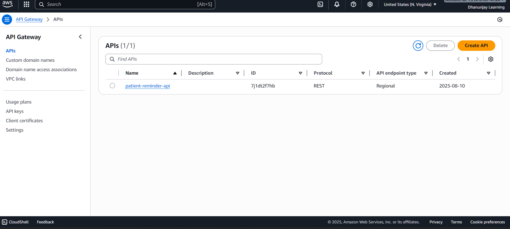

# Patient Reminder Web Application

## 📌 Overview  
The **Patient Reminder Web Application** is a cloud-based solution built on AWS to send automated **Email** and **SMS** reminders to patients. It uses **serverless architecture** with AWS services like **S3, API Gateway, Lambda, Step Functions, SES, and SNS** to ensure scalability, reliability, and low cost.

---

## 🚀 Project Workflow  

### 1. Frontend (Static Website Hosting)  

- Uploaded `index.html` file to **Amazon S3 bucket**.  

- Enabled **bucket versioning** for better management.  

- Enabled **static website hosting** and hosted the frontend.  

- Configured **Object Ownership** → *ACLs enabled* & *Bucket owner preferred*.  

- Disabled **Block Public Access** to allow access to the hosted site.  

- Copied the **S3 website URL** to access the patient reminder frontend. 

---

### 2. API Layer (Amazon API Gateway)  

- Created a **REST API** in API Gateway.  

- Configured **resources, methods, and stages**, then deployed the API.  

- Obtained the **Invoke URL** from API Gateway.  

- Integrated the **API Gateway URL** with `index.html`.

---

### 3. Backend (AWS Lambda Functions)  

Created **three Lambda functions**:  
1. `PatientReminderProcessorLambda` – Handles incoming requests.  
2. `SendEmailLambda` – Sends email notifications using **Amazon SES**.  
3. `SendSmsLambda` – Sends SMS notifications using **Amazon SNS**.  

- Uploaded **Python code** for each Lambda.  
- Functions process input from **API Gateway** and trigger the workflow.  

---

### 4. Workflow Orchestration (AWS Step Functions)  

- Designed a **Step Function** to manage the reminder flow.  
- Logic flow:  
  - If input = **Email**, trigger `SendEmailLambda`.  
  - If input = **SMS**, trigger `SendSmsLambda`.  
  - If input = **Both**, trigger both Lambda functions in sequence.   

---

---

## 📊 Output / Demo

### Patient Reminder Website (Hosted on S3)

### Email Reminder Example

